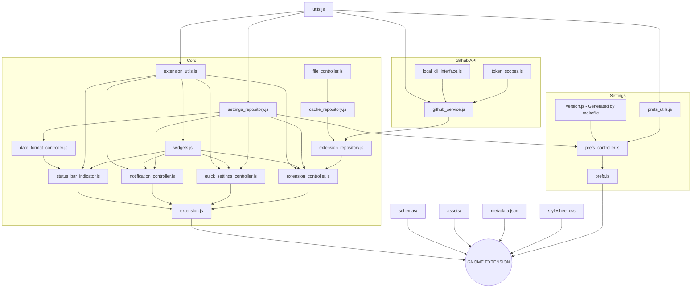

[](https://extensions.gnome.org/extension/5973/github-actions/)

# GitHub Actions Gnome Extension 🧩


[](https://github.com/arononak/github-actions-gnome-extension/graphs/contributors)


<details>
<summary>Table of Contents</summary>

- [GitHub Actions Gnome Extension 🧩 MORE](#github-actions-gnome-extension--more)
- [🏞 Preview](#-preview)
- [🔨 Installation](#-installation)
- [🖥️ Development](#️-development)
- [📝 License](#-license)

</details>

# [🏞 Preview](./docs/SCREENSHOTS.md)

| Default                                                                                                          | Simple mode                                                                                                     |
|:----------------------------------------------------------------------------------------------------------------:|:---------------------------------------------------------------------------------------------------------------:|
|             |          |

# [🔨 Installation](https://github.com/cli/cli/blob/trunk/docs/install_linux.md)

| Steps                | Commands                                      |
|:---------------------|:----------------------------------------------|
| 🔒 Login             | `gh auth login --scopes user,repo,workflow`   |
| 🔓 Check scopes      | `gh auth status`                              |
| 🔄 If any is missing | `gh auth refresh --scopes user,repo,workflow` |

# [🖥️ Development](./docs/TODO.md)




- ### 📜️ Development **rules**

  This project was built using **Aron Flow** (fuck scrum).

  | Before `git push`            | Before deploy                                |
  |:-----------------------------|:---------------------------------------------|
  | ✏️ `make lint-fix`            | 🏞 New screenshots                           |
  |                              | 🦍 [TESTING STEPS](./docs/TESTING_STEPS.md)  |
  |                              | 🏷️ New tag & release                         |
  |                              | 🛰 Deploy only on Fridays !                  |

- ### 📥 Cloning and running

  ```bash
  git clone https://github.com/arononak/github-actions-gnome-extension.git
  cd github-actions-gnome-extension
  make install && make run
  ```

  if the extension fails to load in the window:

  ```bash
  make install && make logout
  make install && make logout
  make logs
  ```

- ### ⌨️ Makefile commands

  | Steps                                                                | Commands                                                          |
  |:---------------------------------------------------------------------|:------------------------------------------------------------------|
  | ▶️  Starts a gnome session in a window                                | `make run`                                                        |
  | ➡️  Copying the extension from the system                             | `make copy`                                                       |
  | 🔎️ Starts code analysis                                              | `make lint`                                                       |
  | ✏️  Starts ESLint fixing                                              | `make lint-fix`                                                   |
  | 🔄 Compiles schemas                                                  | `make compile`                                                    |
  | 🛠️ Builds gnome-extensions package                                   | `make build`                                                      |
  | 📦 Builds and installs on system, gnome restart required             | `make install`                                                    |
  | 📼️ Displays logs of the current Gnome session                        | `make logs`                                                       |
  | 😴 logout                                                            | `make logout`                                                     |

# 📝 License

> [!NOTE]
> Copyright © 2024 Aron Onak. All rights reserved.<br>
> Licensed under the [GPL-3](LICENSE) license.<br>
> If you have any feedback, please contact me at arononak@gmail.com

> [!WARNING]
> The GitHub logo is a trademark of Microsoft.<br>
> This extension is not affiliated, funded, or in any way associated with Microsoft and GitHub.<br>
