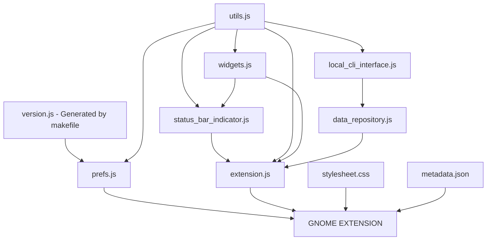

[](https://extensions.gnome.org/extension/5973/github-actions/)

# Github Actions Gnome Extension 🧩

[](https://github.com/arononak/github-actions-gnome-extension/actions/workflows/main.yml)
[](https://opensource.org/licenses/)
[](https://github.com/arononak/github-actions-gnome-extension/releases/latest)

#### 🏞 Badges


#### 🏞 Preview [MORE](SCREENSHOTS.md)


---

# 🔨 Manual configuration

Ubuntu
```bash
sudo apt update
sudo apt install gh
```
[https://github.com/cli/cli/blob/trunk/docs/install_linux.md](https://github.com/cli/cli/blob/trunk/docs/install_linux.md)

#### 🔒 Login

```bash
gh auth login --scopes user,repo,workflow
```
And configure owner and repository in extension settings.

#### 🔓 After logging in

Check the permissions with the command:
```bash
gh auth status
```

If any is missing, you can add it with the command:
```bash
gh auth refresh --scopes user,repo,workflow
```

---

# 🛠 Development



#### ▶️ Start a gnome session in a window
```bash
make run
```

#### 🔨 Build gnome-extensions package

```bash
make build
```

---

# [✅️ TODO](TODO.md)

If you have any feedback, please contact me at arononak@gmail.com

---

# 📝 © Copyright 2023 Aron Onak

> **Warning**<br>
> The GitHub logo is a trademark of Microsoft.<br>
> This extension is not affiliated, funded, or in any way associated with Microsoft and GitHub.
