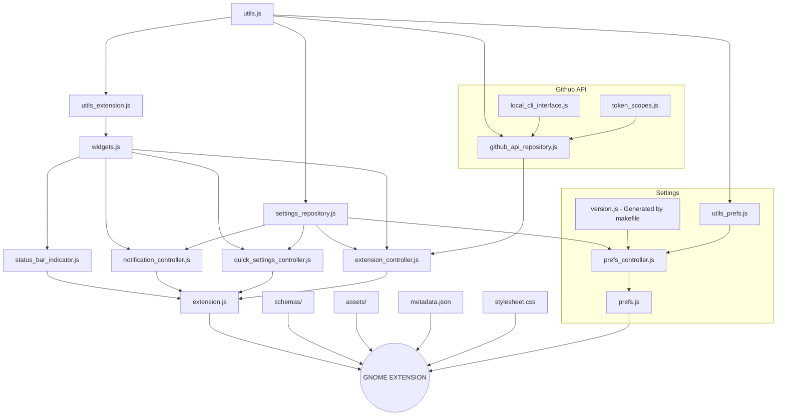

# Github Actions Gnome Extension 🧩

## 🏞 Preview [MORE](./docs/SCREENSHOTS.md)

| SimpleMode - OFF                                                                                                 | SimpleMode - ON                                                                                                 |
|:----------------------------------------------------------------------------------------------------------------:|:---------------------------------------------------------------------------------------------------------------:|
|             |          |
| Quick Settings - Light                                                                                           | Quick Settings - Dark                                                                                           |
|  |  |

## [🔨 Installation](https://github.com/cli/cli/blob/trunk/docs/install_linux.md) and Configuration

| Steps                | Commands                                      |
|:---------------------|:----------------------------------------------|
| 🔒 Login             | `gh auth login --scopes user,repo,workflow`   |
| 🔓 Check scopes      | `gh auth status`                              |
| 🔄 If any is missing | `gh auth refresh --scopes user,repo,workflow` |

## 🛠 Development

| Steps                                       | Commands       |
|:--------------------------------------------|:---------------|
| ▶️ Start a gnome session in a window        | `make run`     |
| ➡️ Copying the extension from the system .  | `make copy`    |
| 🔨 Build gnome-extensions package           | `make build`   |
| 🔄 Compile schemas                          | `make compile` |
| [🦍 TESTING STEPS](./docs/TESTING_STEPS.md) |                |
| [✅️ TODO](./docs/TODO.md) list.             |                |

> **Note** 
> If you have any feedback, please contact me at arononak@gmail.com

---

## 📝 © 2023 Aron Onak

> **Warning** 
> The GitHub logo is a trademark of Microsoft. 
> This extension is not affiliated, funded, or in any way associated with Microsoft and GitHub.
