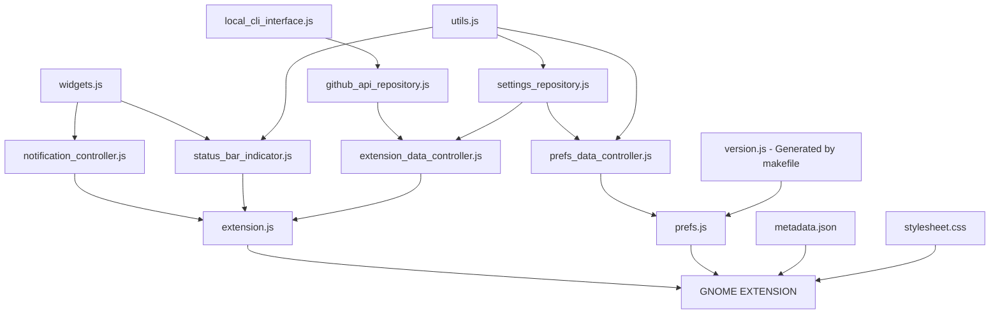

# Github Actions Gnome Extension 🧩

## 🏞 Preview [MORE](./docs/SCREENSHOTS.md)

| SimpleMode OFF                                                                                        | SimpleMode ON                                                                                           |
|:-----------------------------------------------------------------------------------------------------:|:-------------------------------------------------------------------------------------------------------:|
|  |  |

## 🧮 Possible states

| State                          | Default                                                                                                                    | Colored                                                                                                                            |
|:-------------------------------|:--------------------------------------------------------------------------------------------------------------------------:|:----------------------------------------------------------------------------------------------------------------------------------:|
| NOT_INSTALLED_CLI              |        |        |
| NOT_LOGGED                     |               |               |
| LOGGED_NO_INTERNET_CONNECTION  |   |   |
| LOADING                        |                  |                  |
| LOGGED_NOT_CHOOSED_REPO        |          |          |
| INCORRECT_REPOSITORY           |           |                   |
| REPO_WITHOUT_ACTIONS           |     |     |
| IN_PROGRESS                    |              |              |
| COMPLETED_CANCELLED            |                |                |
| COMPLETED_FAILURE              |                  |                  |
| COMPLETED_SUCCESS              |                  |                  |

## [🔨 Installation](https://github.com/cli/cli/blob/trunk/docs/install_linux.md) and Configuration

| Steps                | Commands                                      |
|:---------------------|:----------------------------------------------|
| 🔒 Login             | `gh auth login --scopes user,repo,workflow`   |
| 🔓 Check scopes      | `gh auth status`                              |
| 🔄 If any is missing | `gh auth refresh --scopes user,repo,workflow` |

## [✅️ TODO](./docs/TODO.md) list

> **Note** 
> If you have any feedback, please contact me at arononak@gmail.com

## 🛠 Development

| Steps                                    | Commands     |
|:-----------------------------------------|:-------------|
| ▶️ Start a gnome session in a window     | `make run`   |
| ➡️ Copying the extension from the system | `make copy`  |
| 🔨 Build gnome-extensions package        | `make build` |

## 📝 © 2023 Aron Onak

> **Warning** 
> The GitHub logo is a trademark of Microsoft. 
> This extension is not affiliated, funded, or in any way associated with Microsoft and GitHub.

