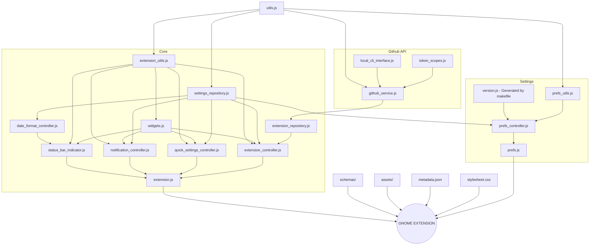

[](https://extensions.gnome.org/extension/5973/github-actions/)

# Github Actions Gnome Extension 🧩

[](https://opensource.org/licenses)

[](https://github.com/arononak/github-actions-gnome-extension/releases/latest)


[](https://github.com/arononak/github-actions-gnome-extension/graphs/contributors)


# 🏞 Preview [MORE](./docs/SCREENSHOTS.md)

| SimpleMode - OFF                                                                                                 | SimpleMode - ON                                                                                                 |
|:----------------------------------------------------------------------------------------------------------------:|:---------------------------------------------------------------------------------------------------------------:|
|             |          |

# [🔨 Installation](https://github.com/cli/cli/blob/trunk/docs/install_linux.md) and Configuration

| Steps                | Commands                                      |
|:---------------------|:----------------------------------------------|
| 🔒 Login             | `gh auth login --scopes user,repo,workflow`   |
| 🔓 Check scopes      | `gh auth status`                              |
| 🔄 If any is missing | `gh auth refresh --scopes user,repo,workflow` |

# 🖥️ Development [TODO](./docs/TODO.md)



## 📜️ Development rules
This project was built using **Aron Flow** (fuck scrum)

| Before `git push`            | Before deploy                                |
|:-----------------------------|:---------------------------------------------|
| ✏️ `make lint-fix`            | 🏞 New screenshots                           |
|                              | 🦍 [TESTING STEPS](./docs/TESTING_STEPS.md)  |
|                              | 🏷️ New tag & release                         |
|                              | 🛰 Deploy only on Fridays !                  |

## 🛫 Cloning and running

```bash
git clone https://github.com/arononak/github-actions-gnome-extension.git
cd github-actions-gnome-extension
```

```bash
make start
```

if the extension fails to load in the window:

```bash
make install
RELOGIN
make logs
```


## ⌨️ Commands

| Steps                                                                | Commands                                                          |
|:---------------------------------------------------------------------|:------------------------------------------------------------------|
| ▶️  Starts a gnome session in a window                                | `make run`                                                        |
| ➡️  Copying the extension from the system                             | `make copy`                                                       |
| 🔎️ Starts code analysis                                              | `make lint`                                                       |
| ✏️  Starts ESLint fixing                                              | `make lint-fix`                                                   |
| 🔄 Compiles schemas                                                  | `make compile`                                                    |
| 🛠️ Builds gnome-extensions package                                   | `make build`                                                      |
| 📦 Builds and installs on system, gnome restart required             | `make install`                                                    |
| 💻️ Installs the extension and starts a new gnome session in a window | `make start`                                                      |

---

# 📝 © 2023 Aron Onak

> [!WARNING]
> The GitHub logo is a trademark of Microsoft.<br>
> This extension is not affiliated, funded, or in any way associated with Microsoft and GitHub.<br>
> If you have any feedback, please contact me at arononak@gmail.com
