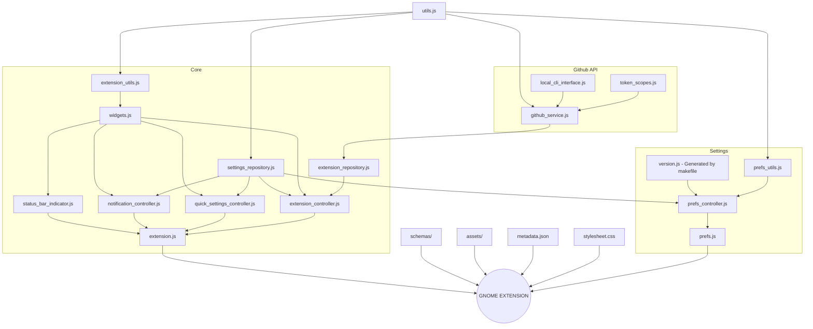

# Github Actions Gnome Extension 🧩

# 🏞 Preview [MORE](./docs/SCREENSHOTS.md)

| SimpleMode - OFF                                                                                                 | SimpleMode - ON                                                                                                 |
|:----------------------------------------------------------------------------------------------------------------:|:---------------------------------------------------------------------------------------------------------------:|
|             |          |

# [🔨 Installation](https://github.com/cli/cli/blob/trunk/docs/install_linux.md) and Configuration

| Steps                | Commands                                      |
|:---------------------|:----------------------------------------------|
| 🔒 Login             | `gh auth login --scopes user,repo,workflow`   |
| 🔓 Check scopes      | `gh auth status`                              |
| 🔄 If any is missing | `gh auth refresh --scopes user,repo,workflow` |

# 🛠 Development

| Steps                                       | Commands       |
|:--------------------------------------------|:---------------|
| ▶️ Start a gnome session in a window         | `make run`     |
| ➡️ Copying the extension from the system     | `make copy`    |
| 🔨 Build gnome-extensions package           | `make build`   |
| 🔄 Compile schemas                          | `make compile` |
| 🦍 [TESTING STEPS](./docs/TESTING_STEPS.md) |                |
| ✅️ [TODO LIST](./docs/TODO.md)              |                |

 

> **Note** 
> If you have any feedback, please contact me at arononak@gmail.com

---

# 📝 © 2023 Aron Onak

> **Warning** 
> The GitHub logo is a trademark of Microsoft. 
> This extension is not affiliated, funded, or in any way associated with Microsoft and GitHub.

